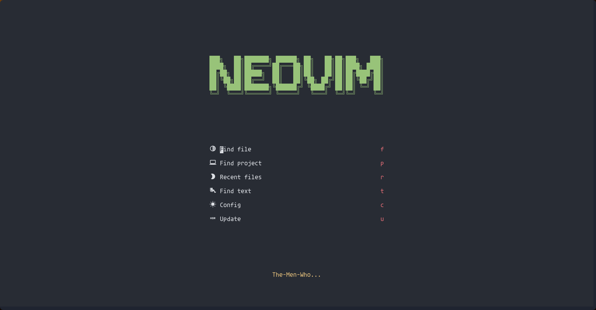

# ...Under Construction

## Neovim Config



checkhealth

```sh
sudo pacman -S xsel
```

```sh
pip install pynvim
```

```sh
npm i -g neovim
```

Agave Nerd Font

After moving fonts to `~/.local/share/fonts/`

Run: `$ fc-cache -f -v`

**NOTE:** (If you are seeing boxes without icons, try changing this line from `false` to `true`: [link](https://github.com/ChristianChiarulli/nvim/blob/ac41efa237caf3a498077df19a3f31ca4b35caf3/lua/user/icons.lua#L5))
